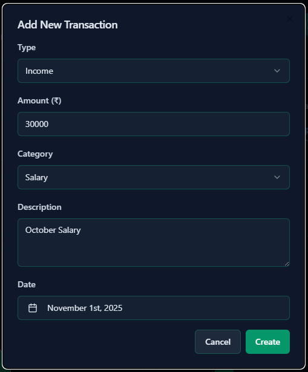
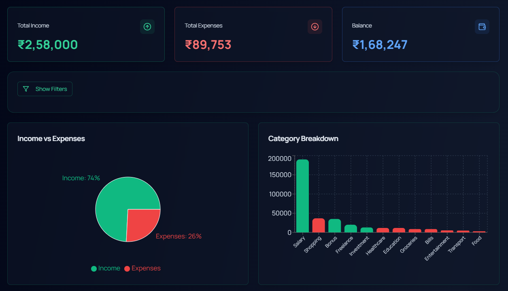
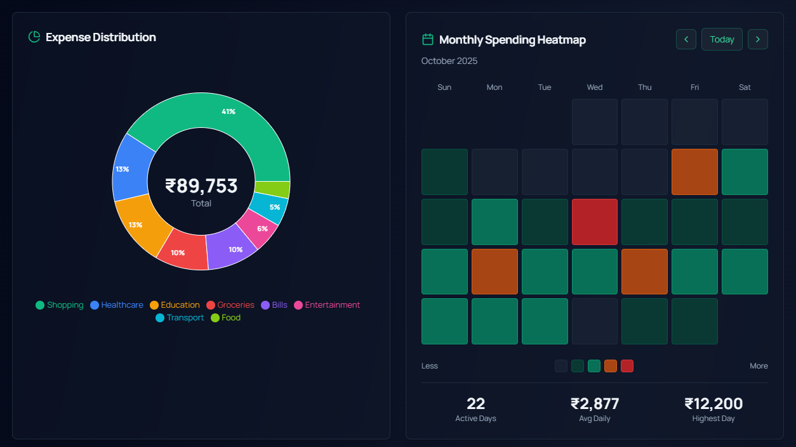
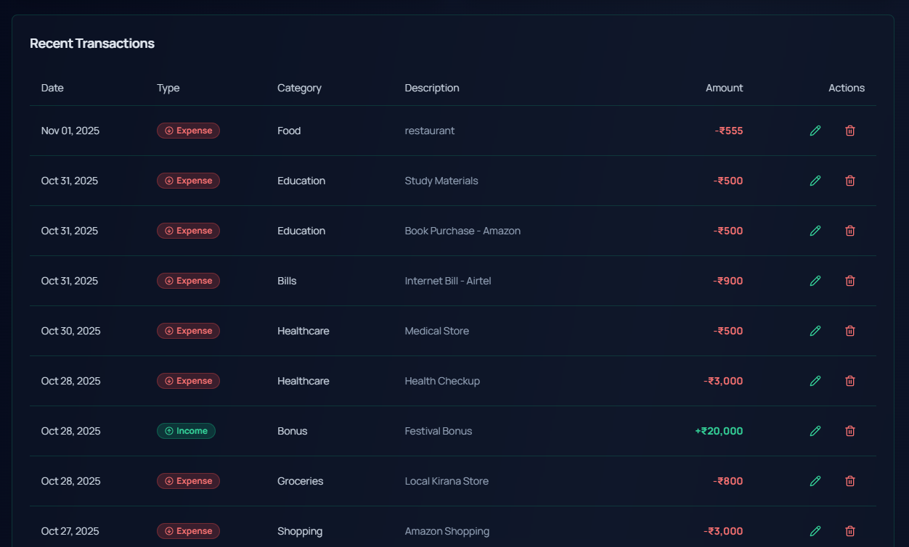

# 💰 Expense Tracker Application

A **modern, full-featured web application** for personal finance management built with **React, Node.js, Express, and MongoDB**.  
This system enables users to efficiently track income and expenses with an **intuitive dashboard**, **interactive visualizations**, and **AI-powered financial insights**.

---

### 🎯 Objectives

- To develop a fully functional **Expense Tracker Web Application** using the **MERN Stack (MongoDB, Express, React, Node.js)**.  
- To enable users to efficiently **manage income and expense transactions** with complete **CRUD operations**.  
- To implement **advanced filtering** by transaction type, category, and date range.  
- To provide **visual data representations** through interactive **charts and heatmaps**.   
- To ensure **clean, reusable, and well-structured code** with **Redux Toolkit** for state management.

---

### 🛠️ Technology Stack

#### 🧩 Backend

- **Node.js** – JavaScript runtime environment  
- **Express.js (v4.18+)** – Web application framework  
- **MongoDB** – NoSQL database  
- **Mongoose** – MongoDB object modeling  
- **Google Generative AI** – AI-powered financial insights  
- **dotenv** – Environment variable management  
- **cors** – Cross-origin resource sharing  
- **helmet** – Security middleware  

---

#### 🎨 Frontend

- **React (v18+)** – UI library  
- **Redux Toolkit** – State management  
- **Tailwind CSS** – Utility-first CSS framework  
- **shadcn/ui** – Reusable component library  
- **Recharts** – Chart library for data visualization  
- **Axios** – HTTP client  
- **React Router** – Client-side routing  
- **date-fns** – Date utility library  
- **Framer Motion** – Animation library  
- **Lucide React** – Icon library  

---

#### 🧰 Development Tools

- **Git** – Version control  
- **npm** – Package manager  
- **Nodemon** – Auto-restart development server  
- **ESLint** – Code linting  

---

### 📁 Project Structure

    Expense-Tracker/
    │
    ├── backend/
    │   ├── config/
    │   │   └── db.js                     # Database configuration
    │   ├── controller/
    │   │   └── transactionController.js  # Transaction CRUD logic
    │   ├── models/
    │   │   └── Transaction.js            # Transaction schema
    │   ├── routes/
    │   │   └── transactionRoutes.js      # API endpoints
    │   ├── services/
    │   │   └── aiService.js              # AI integration service
    │   ├── seed.js                       # Seed sample data
    │   └── server.js                     # Express server setup
    │
    ├── frontend/
    │   ├── src/
    │   │   ├── components/
    │   │   │   ├── Dashboard.jsx         # Main dashboard
    │   │   │   ├── TransactionForm.jsx   # Add/Edit form
    │   │   │   ├── TransactionList.jsx   # Transaction table
    │   │   │   └── AIReview.jsx          # AI financial insights
    │   │   ├── store/
    │   │   │   └── transactionSlice.js   # Redux state management
    │   │   ├── App.jsx                   # Root component
    │   │   └── index.js                  # App entry point
    │   ├── package.json                  # Frontend dependencies
    │   └── tailwind.config.js            # Tailwind configuration
    │
    └── README.md                         # Project documentation

### 🚀 Installation & Setup

## 🧩 Prerequisites
Make sure you have the following installed:
Node.js 16+ and npm
MongoDB (local installation or MongoDB Atlas)
Git (for cloning the repository)
Google Gemini API Key (for AI-powered insights)

### ⚙️ Implementation Steps
**Step 1: Clone the Repository**

Clone the project repository from GitHub:

    git clone https://github.com/yourusername/Expense-Tracker.git
    cd Expense-Tracker

**Step 2: Backend Setup**

Navigate to the backend directory:

    cd backend

Install dependencies:

    npm install

Create a .env file in the backend directory:

    PORT=5000
    NODE_ENV=development
    MONGODB_URI=mongodb://localhost:27017/expense
    GEMINI_API_KEY=your_gemini_api_key_here

Get your Gemini API Key from Google AI Studio.

Start the backend server:

    npm run dev

Backend will run at: 

    http://localhost:5000

**Step 3: Frontend Setup**

Open a new terminal window and navigate to the frontend directory:

    cd frontend

Install dependencies:

    npm install

Start the development server:

npm start

Frontend will run at: 

    http://localhost:3000

**Step 4: Access the Application**

Open your web browser and visit:

    http://localhost:3000

### The application is now ready to use! 🎉

---

## ✨ Features

### 🧩 Core Functionality

#### 📊 Dashboard Overview
- **Summary Cards:** Real-time display of total income, expenses, and balance  
- **Visual Analytics:** Interactive pie charts showing income vs expense ratio  
- **Category Breakdown:** Bar charts displaying spending by category  
- **Monthly Insights:** Track financial trends over time  

#### 💼 Transaction Management
- **Complete CRUD Operations:** Create, read, update, and delete transactions  
- **Dual Transaction Types:** Support for both income and expense entries    
- **Date Tracking:** Record and filter transactions by date  
- **Detailed Descriptions:** Add context to each transaction  
- **Instant Updates:** Real-time UI updates with Redux state management  

#### 🔍 Advanced Filtering
- **Type Filter:** View only income or expense transactions  
- **Category Filter:** Filter by specific spending categories  
- **Date Range Filter:** Custom date range selection  
- **Combined Filters:** Apply multiple filters simultaneously   

#### 📈 Data Visualizations

**Income vs Expense Pie Chart:**  
Visual representation of income and expense proportions

**Category Bar Chart:**  
Horizontal bar chart showing spending distribution across categories

**Expense Distribution Donut Chart:**  
Interactive donut chart with center total display for expense breakdown

**Monthly Spending Heatmap:**  
Calendar-style heatmap showing spending intensity per day with:
- Month-by-month navigation  
- Color-coded spending intensity  
- Hover tooltips with transaction details  
- Monthly statistics (active days, average daily, highest day)  

#### 🤖 AI-Powered Financial Review
**Powered by Google Gemini 2.0 Flash:**
- **Comprehensive Analysis:** AI analyzes your complete transaction history  
- **Personalized Insights:** Get tailored financial health recommendations  
- **Spending Patterns:** Identify trends and unusual expenses  
- **Financial Health Rating:** Overall assessment (Excellent/Good/Fair/Poor)   

#### 🔐 Data Management
- **MongoDB Integration:** Reliable NoSQL database storage  
- **RESTful API:** Well-structured endpoints for all operations  
- **Input Validation:** Server-side and client-side validation  
- **Error Handling:** Comprehensive error messages and user feedback  
- **Loading States:** Visual indicators during data operations

## 📸 Screenshots

### 📝 Transaction Form  
**User-friendly form for adding and editing income and expense transactions with validation.**

### 🏠 Dashboard - Overview  
**Main dashboard displaying summary cards with total income, expenses, and current balance alongside visual analytics.**

### 📊 Dashboard - Charts & Heatmap  
**Interactive charts showing expense distribution and monthly spending heatmap for visual insights.**

### 📋 Transaction List  
**Comprehensive table view of all transactions with edit, delete, and filter capabilities.**

## 🎥 Project Demonstration
Watch the complete walkthrough of the **Expense Tracker Application** showcasing key features including transaction management, visual analytics, AI-powered insights, and the interactive spending heatmap.

### 📽️ **Project Video:**  

https://github.com/user-attachments/assets/554a0a8c-160e-4ca1-a579-329d50c07bf2

---
